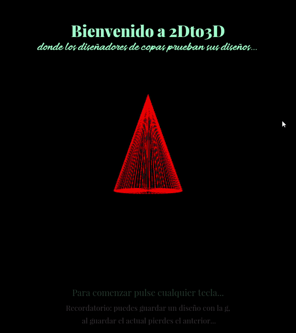
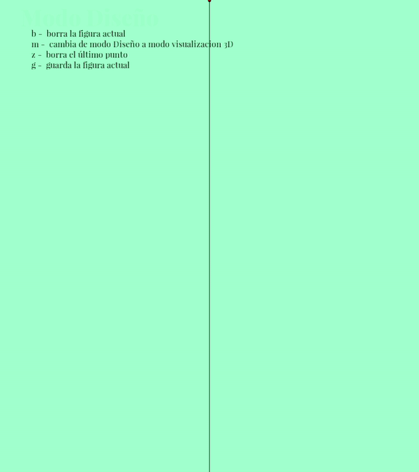

# CIU-P2-2Dto3D
Practica 2 de CIU - tenemos que diseñar un programa capaz de crear una figura 3D de revolución a partir de un perfil 2D.

## Autor
Jacobo Placeres Cabrera

## Trabajo
Para explicar con mayor facilidad el proyecto realizado, vamos a dividir el programa en 3 fases:
* Menú inicio
* Perfilado
* Modelado 3D

### Menú inicio
Aqui mostramos el nombre del programa, algún consejo útil y poco más.

### Modo Diseño
En esta fase dibujaremos nuestro perfil 2D, en la esquina superior izquierda se muestra la fase en la que nos encontramos, así como la lista de comandos que podemos usar.

### Modo 3D
Finalmente al pusar la tecla "m" podemos cambiar nuestro modelo 2D a 3D, dentro de este espacio, podremos desplazar la figura así como acercarla o alejarla.

## Eventos
Explicamos más funcionalidades.
### Menú inicio
*   Pulsar cualquier tecla causa que saltemos del menú inicial a la fase de perfilado

### Modo Diseño
*   **b** - borra la figura actual 
*   **m** - Cambia de modo Diseño a modo visualización 3D
*   **z** - borra el último punto 
*   **g** - guarda la figura actual (Esta se muestra en azul, al guardar la figura actual, se sustituye la que estuviese guardada antes)

### Modo 3D
*   **m**                     - Cambia del modo Visualización 3D a modo Diseño
*   **flechas de dirección**  - Permiten mover la figura en el eje X y en el eje Y
*   **w**                     - Acerca la figura (eje Z)
*   **s**                     - Alejas la figura (eje Z)

# Notas de uso
Las fuentes deben encontrarse en la misma carpeta donde se encuentran los ficheros

# Referencias
**[Reference](https://www.fontsquirrel.com/fonts/list/popular)**

**[Font Squirrel](https://www.fontsquirrel.com/fonts/list/popular)**
